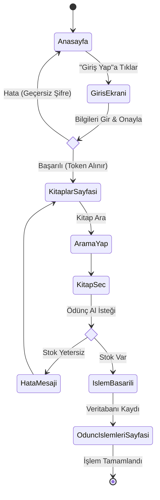
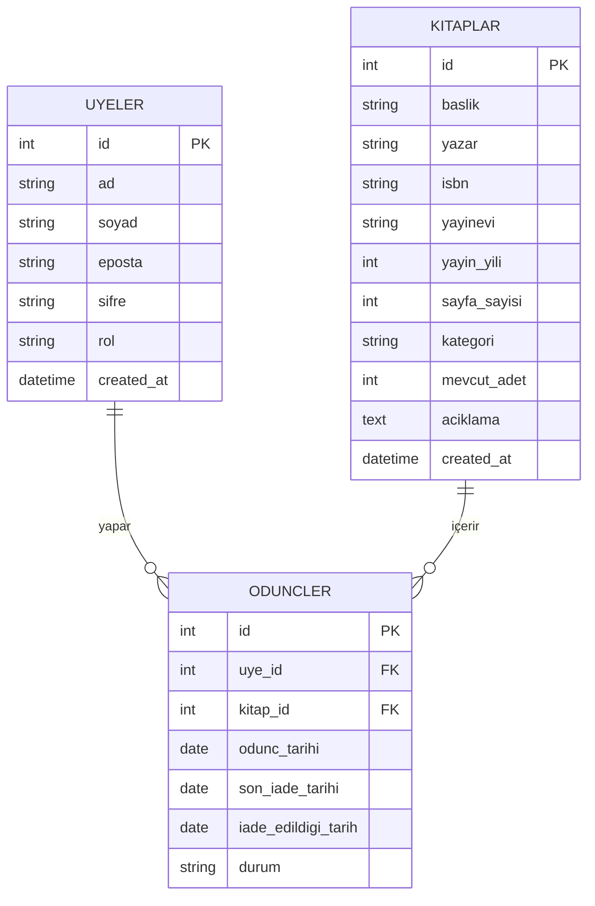

# RafArkası Kütüphane Yönetim Sistemi - UML Diyagramları

Projenin mimarisini ve süreçlerini anlatan temel UML diyagramları aşağıda yer almaktadır. Bu diyagramlar **Mermaid** sözdizimi ile hazırlanmıştır. Github üzerinde doğrudan görsel olarak render edilir.

## 1. Use-Case (Kullanım Durumu) Diyagramı
Sistemin farklı aktörler (Üye ve Admin) tarafından nasıl kullanıldığını gösterir.

```mermaid
usecaseDiagram
    actor Üye as "Standart Üye"
    actor Admin as "Sistem Yöneticisi"
    
    package "RafArkası Kütüphane Sistemi" {
        usecase UC1 as "Sisteme Giriş/Kayıt"
        usecase UC2 as "Kitapları Listeleme & Arama"
        usecase UC3 as "Ödünç Alma"
        usecase UC4 as "Ödünç İade Etme"
        usecase UC5 as "Kendi İşlemlerini Görme"
        
        usecase UC6 as "Kitap Ekle/Düzenle/Sil"
        usecase UC7 as "Üye Yönetimi"
        usecase UC8 as "Tüm Ödünçleri Yönetme"
        usecase UC9 as "İstatistik & Rapor Görüntüleme"
    }
    
    Üye --> UC1
    Üye --> UC2
    Üye --> UC3
    Üye --> UC4
    Üye --> UC5
    
    Admin --> UC1
    Admin --> UC2
    Admin --> UC6
    Admin --> UC7
    Admin --> UC8
    Admin --> UC9
```

*(Not: Mermaid Use-Case desteğini yeni standartlarında kısıtlı verebilir, alternatif olarak akış ile Use-Case senaryoları simüle edilebilir)*

## 2. Activity (Aktivite) Diyagramı
Bir üyenin sisteme girip kitap ödünç alma sürecinin adım adım akışını gösterir.



## 3. ER (Veritabanı İlişki) Diyagramı
PostgreSQL veritabanındaki tabloları ve birbirleriyle olan ilişkilerini gösterir.



## 4. Component (Bileşen İlişkileri) Diyagramı
Frontend (React) ve Backend (Express) arasındaki mimari bileşenlerin veri akışını gösterir.

```mermaid
graph TD
    subgraph "Frontend (React Uygulaması)"
        UI[Kullanıcı Arayüzü / Sayfalar]
        Ctx[Yetkilendirme Context API]
        Axios[Axios API İstemcisi]
        
        UI <--> Ctx
        UI <--> Axios
    }

    subgraph "Backend (Node.js & Express)"
        Router[Express Rotaları]
        AuthMid[Yetkilendirme Middleware]
        Controllers[İş Mantığı / Controllers]
        
        Router --> AuthMid
        AuthMid --> Controllers
    }

    subgraph "Veritabanı"
        Seq[Sequelize ORM]
        DB[(PostgreSQL)]
        
        Controllers <--> Seq
        Seq <--> DB
    }

    Axios <-->|HTTP REST İsteği & JWT Token| Router
```
